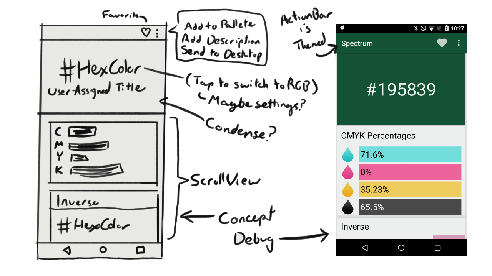

# Spectrum (Working name)
An Android app that can store colors. It can find colors by RGB, HSL, or hex. Currently, it can show the inverse color, CMYK percentages, and triadic colors. This app demonstrates custom views with the CardView used for things like inverse color and CMYK values.

